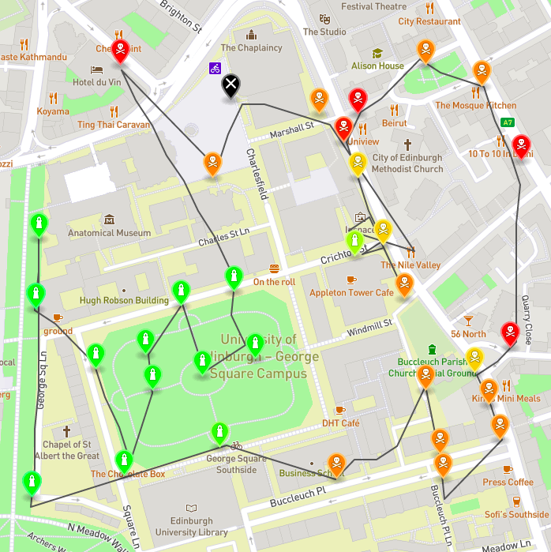
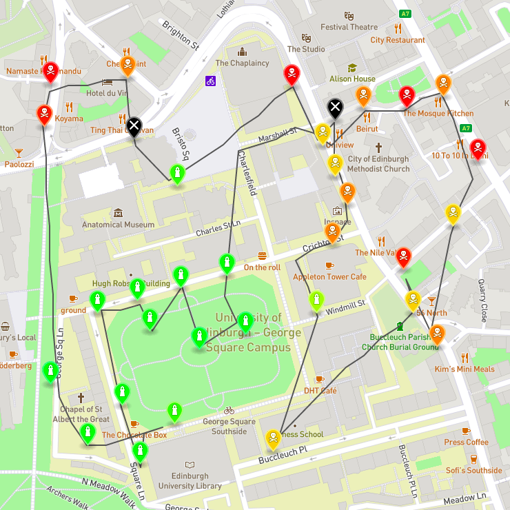

# Informatics Large Practical (ILP) 2020-21 Coursework 2

**Idea:** Program an autonomous drone which (fictiously) collects readings from air quality sensors around the University of Edinburgh area. The challenge is to collect those readings within 150 moves or less, and without flying into No-Fly-Zones and the drone flight path must be within a certain area. The drone's starting location will always be in the given area. Further details can be found in the ILP Coursework document.

 Using my own enhanced greedy algorithm, described in the ILP Report, has allowed me to implement this task effectively.

**Final Grade:** 81% (A2)

**Programming Language**: Java

**IDE**: Eclipse

## Personal Notes
Tackling this coursework assignment was quite interesting, as I had to implement proper software engineering practices, previously learned in Year 1 and 2, into this project. In addition, I got to apply concepts previously learned in university into a world problem.

## Brief Instructions
1. Starting up the WebServer
    - Running the web server can be done using Terminal
    - Go to the directory containing the WebServer
    - `java -jar WebServerLite.jar`
    - To verify the web server is running can be done by visiting the address `http://localhost:80` in your web browser
    - If localhost cannot be run on port 80, try on port 9898 using the following command: `java -jar WebServerLite.jar /path/to/web/server/content/ 9898`
    - Obviously please change the path to appropriate path in your directory
2. Running the Java program
    - There are two options: command line and IDE
    - Command Line: `java -jar target/aqmaps-0.0.1-SNAPSHOT.jar 15 06 2021 55.9444 -3.1878 5678 9898`
        - The last seven arguments take in the day, month, year, starting latitude, starting longtitude, seed, and port number of web server respectively
    - IDE:
        - Preferred IDE is Eclipse
        - Execute the last seven arguments from command line and run it in App.java main class
        - Example: `15 06 2021 55.9444 -3.1878 5678 9898`
        - The last seven arguments take in the day, month, year, starting latitude, starting longtitude, seed, and port number of web server respectively

    - Once executed, it would generate a flightpath text file and geojson file respectively corresponding to a date into your current directory.
    - You can render the content from the geojson file on geojson.io
3. Instructions explained in further detail can be referred to the ILP coursework document.
    

## Code Organization
* [ilp-coursework-document](https://github.com/JHoweWowe/ilp-coursework2/blob/master/ilp-coursework-document.pdf): The coursework document contains in-depth details of the instructions and explainations of the given scenario. This file is created by the ILP course instructors.
* [ilp-report](https://github.com/JHoweWowe/ilp-coursework2/blob/master/ilp-report.pdf): My report contains the software architecture description, class documentation and further explains my drone flight-path algorithm in further detail.
* [feedback.txt](https://github.com/JHoweWowe/ilp-coursework2/blob/master/feedback.txt): Grading scheme used to mark my project in full detail.
* [ilp-results](https://github.com/JHoweWowe/ilp-coursework2/tree/master/ilp-results): The folder contains the text and geojson files for each date, where the month and day is the same for the year 2020. Required for submission.
* [pom.xml](https://github.com/JHoweWowe/ilp-coursework2/blob/master/pom.xml): XML file to compile and create Maven project.
* [WebServer](https://github.com/JHoweWowe/ilp-coursework2/tree/master/WebServer): Folder containing the JSON files for the buildings, maps, and words. 

## Screenshots

The first image above shows the algorithm generated for the date 2020-01-01. This clearly showed the drone in the middle of its flying route was stuck but managed to get out of the loop and finish the route.

The next image above shows the algorithm generated for the date 2020-03-03, simulating a perfect drone flight path.

## References
WebServer files are generated by the ILP team, and were given as a reference to conduct the project.

The WebServer jar file is by:
http://www.jibble.org/jibblewebserver.php